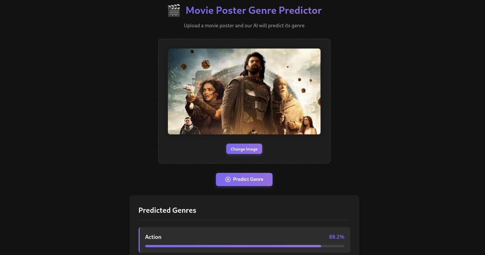
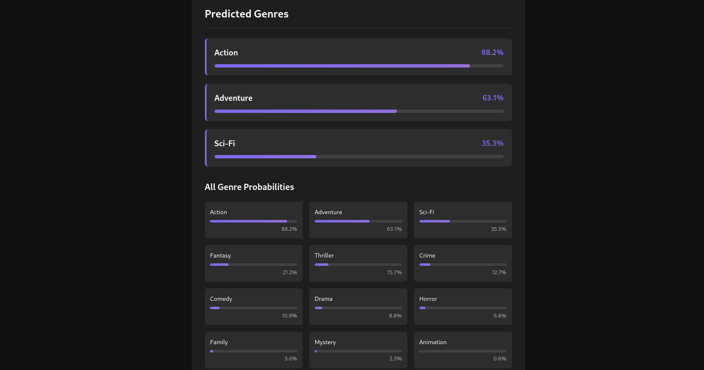

# 🎬 Movie Genre Predictor

A deep learning application that predicts movie genres based on movie poster images.

## 📸 Screenshots

## 🎥 Demo Video

<!-- Or if embedding directly on GitHub: -->
<!-- <video src="path-to-video" controls width="640"></video> -->

## 📝 Project Overview

This project utilizes deep learning to predict movie genres from poster images. Based on research from Stanford University on movie poster classification, the system uses a modified DenseNet169 architecture to identify visual patterns associated with different film genres.

### Live Demo

- **Frontend**: [Movie Genre Predictor](https://moviegenre.netlify.app/)
- **Backend API**: Deployed on Hugging Face Spaces

## 🧠 Model Architecture

The core of this project is a modified DenseNet169 CNN architecture:

- **Base model**: DenseNet169 (pre-trained on ImageNet)
- **Custom layers added**:
  - Global Average Pooling
  - Dense layer (1024 units, ReLU activation)
  - Dropout (0.5)
  - Dense layer (128 units, ReLU activation)
  - Dropout (0.3)
  - Output layer (sigmoid activation for multi-label classification)

The model was trained using a weighted loss function to handle genre imbalance, as described in the Stanford University research paper *"Classification of Movie Posters to Movie Genres"* by Sung and Chokshi.

## 🛠️ Technical Stack

### Backend
- TensorFlow/Keras for model training and inference
- Flask for API development
- Python for data processing

### Frontend
- React.js for UI components
- Axios for API integration
- CSS for styling

## 🔍 Features

- **Drag-and-drop interface** for easy poster upload
- **Real-time analysis** of movie posters
- **Multi-genre prediction** with confidence scores
- **Visualization** of genre probabilities
- **Responsive design** for desktop and mobile

## 📊 Results

The model achieves:
- **F1 score** of 0.77 across genres
- **AUC (Area Under Curve)** of 0.67
- **Outperforms previous state-of-the-art models** in this domain

## 🧪 How It Works

1. User uploads a movie poster image.
2. Image is preprocessed (resized to 350x350 pixels, normalized).
3. The DenseNet169 model analyzes the image.
4. Results are displayed showing the most likely genres with probability percentages.

## 🚀 Future Improvements

- Integration of YOLO object detection for identifying key poster elements.
- Expansion of the genre classification set.
- Fine-tuning on a larger, more balanced dataset.
- Addition of poster generation capabilities based on selected genres.

## 📚 References

This project is based on research from:
- Sung, S., & Chokshi, R. (2018). *"Classification of Movie Posters to Movie Genres."* Stanford University.

## 🔗 Connect

Feel free to reach out if you have questions or would like to collaborate on improving this project!

## 📄 License

This project is open source and available under the **MIT License**.
